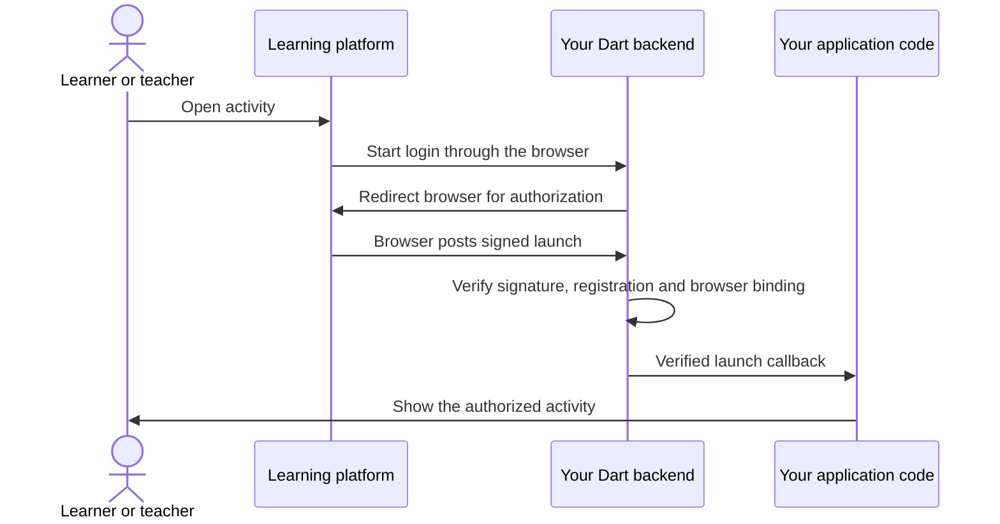

# lti.dart

Build a Dart application that learners and teachers can open directly from a
learning platform such as ByCS. These server-side packages handle **LTI 1.3**,
the protocol that connects the platform to your application.

You build the learning activity. The library verifies launches and provides APIs
for selecting activities, reading course memberships and working with grades.
No prior knowledge of LTI is needed to follow the getting-started guide.

## Start here

- **I want a working HTTP server:** follow the [Shelf quickstart](packages/lti_shelf/README.md).
- **I use another server framework:** start with the [core package](packages/lti/README.md).
- **I want to contribute:** see [repository setup](#repository-setup) below.

| Package | What it does | When to use it |
| --- | --- | --- |
| [`lti`](packages/lti/README.md) | Verifies launches; handles signing, activity selection, memberships and grades | Every tool backend |
| [`lti_shelf`](packages/lti_shelf/README.md) | Connects `lti` to a Shelf HTTP server, including routes and browser cookies | The easiest starting point for a Shelf backend |

Both packages are pure Dart. They run on your **server**, including when the
learning interface is built with Flutter Web. Keep signing keys, token handling
and platform service calls in the backend.

## What is LTI?

**LTI stands for Learning Tools Interoperability.** It is a standard that lets a
learning management system (LMS), such as ByCS, connect to an external learning
application. Instead of building a separate integration for every LMS, your tool
uses the same protocol with compatible platforms.

Suppose a teacher adds your quiz to a course. A learner clicks it inside the
learning platform. The platform sends a signed message identifying the activity,
the course and, when provided, the learner. Your backend checks this message
before showing the quiz. Your tool can use the verified identity to create its
own session, without asking for the learner's LMS password. Which identity and
profile fields are sent depends on the platform's privacy settings.

LTI does not provide the quiz UI, store your application data or decide your
application permissions. It also does not upload your application into the LMS:
you host the tool separately.

In LTI terminology, the learning platform is the **platform** and your application
is the **tool**. Opening an activity this way is a **resource launch**.



The library checks the protocol message. Your application decides what the user
may do, creates its own session and renders the activity.

## Learn these terms as you need them

| Term | Meaning |
| --- | --- |
| Registration | Configuration that connects your tool to a trusted platform |
| Issuer | The platform's exact identifier, usually an HTTPS URL |
| Client ID | The identifier the platform assigns to your tool registration |
| Deployment ID | Identifies a particular deployment of the registered tool |
| Context | Usually the course containing the activity |
| Resource link | The particular activity link placed in a course |
| OIDC | The login exchange used before the signed launch arrives |
| JWT | A signed message; the incoming launch is carried in an `id_token` |
| JWKS | A JSON document containing public keys for verifying signatures |

You do not need to implement OIDC or parse launch JWTs yourself when using the
Shelf adapter.

## Add features after your first launch

LTI Advantage adds three capabilities. Start with a resource launch, then enable
only the features your application needs and the platform permits.

| User need | LTI feature | Next step |
| --- | --- | --- |
| A teacher chooses one of your activities while adding it to a course | **Deep Linking** | [Selection and return guide](docs/deep-linking.md) |
| Your tool reads the course's members and their roles | **NRPS** — Names and Role Provisioning Services | [Service guide](docs/services.md#nrps) |
| Your tool creates gradebook columns or submits scores | **AGS** — Assignment and Grade Services | [Service guide](docs/services.md#ags) |

Deep Linking responses and service authentication require a persistent tool
signing key. See [signing](docs/signing.md) and [OAuth authentication](docs/oauth.md).
A service may be unavailable if the platform has not enabled it for this tool.

## Status and ByCS

**Development release; not formally certified.** Tool-side LTI 1.3 Core and
Advantage are implemented and covered by local tests. Dynamic Registration and
other separate extensions are not implemented; registration is manual.

Live ByCS tests reported successful resource launches, Deep Linking selection
and cancellation, OAuth, membership reads, gradebook column operations and score
submission/readback/clearing with a test learner. These tests used a directly
configured RSA public key. ByCS retrieval of the tool's JWKS URL remains
unresolved; broader browser and platform coverage is still needed.

See the [ByCS setup and test guide](docs/bycs-testing.md),
[implementation matrix](docs/implementation.md) and
[architecture](docs/architecture.md) for details. The ByCS runner is a diagnostic
example, not a production learning application.

## Before going into production

The quickstart deliberately uses in-memory storage and a minimal callback.
Replace these with shared, atomic login-transaction storage, application sessions
and authorization appropriate to your application. Configure HTTPS, request
limits and login rate limiting. For embedded launches, account for the platform's
framing policy and the browser's cookie support; the Shelf guide explains this.

## Repository setup

For working on this repository, install FVM and use the pinned Flutter SDK
(Flutter 3.47.0, Dart 3.13.0). Flutter supplies the SDK here; these packages do not
require a Flutter UI. Melos manages the two packages together.

```sh
fvm install
fvm dart pub get
fvm dart run melos bootstrap
```

Run the checks from the repository root:

```sh
fvm dart run melos run analyze
fvm dart run melos run test --no-select
fvm dart run melos run format:check
fvm dart run melos run docs
```

Generated API documentation is written to `build/api/lti/index.html` and
`build/api/lti_shelf/index.html`. Public APIs also have Dartdocs in IDE tooltips.
No code generation is currently needed.

See [CONTRIBUTING.md](CONTRIBUTING.md) for Conventional Commits and versioning.

## Specification references

You can use the packages without reading these first:

- [LTI 1.3 Core](https://www.imsglobal.org/spec/lti/v1p3/)
- [1EdTech Security Framework](https://www.imsglobal.org/spec/security/v1p0/)
- [Deep Linking 2.0](https://www.imsglobal.org/spec/lti-dl/v2p0)
- [Assignment and Grade Services 2.0](https://www.imsglobal.org/spec/lti-ags/v2p0)
- [Names and Role Provisioning Services 2.0](https://www.imsglobal.org/spec/lti-nrps/v2p0)
