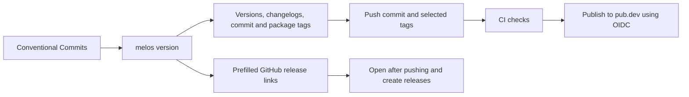

# Versioning and publishing

Release work starts locally with `melos version`. GitHub Actions publishes the
package versions identified by the pushed tags. Creating a GitHub release page
is a separate documentation step using the links Melos prints.



## One-time setup

1. The repository is `fischerscode/lti.dart`. Melos and both package manifests
   already contain its GitHub metadata for commit links and release pages.
   Point your local `origin` at `https://github.com/fischerscode/lti.dart.git`.
2. The project uses the MIT license. Each package includes its own `LICENSE`
   copy so the license is also present in published archives.
3. Check that you control the intended pub.dev package names. Each package's
   **first version must be published manually** from an authorized account;
   automated publishing works only for packages that already exist.
4. After that first publication, enable **Automated publishing → GitHub Actions**
   in each package's pub.dev Admin tab with repository `fischerscode/lti.dart` and these
   exact patterns:

   | Package | pub.dev tag pattern | Example pushed tag |
   | --- | --- | --- |
   | `lti` | `lti-v{{version}}` | `lti-v0.1.0-dev.2` |
   | `lti_shelf` | `lti_shelf-v{{version}}` | `lti_shelf-v0.1.0-dev.2` |

The workflow uses short-lived GitHub OIDC credentials through
`dart-lang/setup-dart`. No pub.dev access token or Google credential secret is
needed. It does not require a GitHub deployment environment. If you later require
one on pub.dev, also set the same environment on the workflow's publish job.
Restrict who can push release tags using repository rules as appropriate.

See [pub.dev automated publishing](https://dart.dev/tools/pub/automated-publishing)
for account-side setup. This repository configuration alone cannot enable the
package's pub.dev Admin settings.

## First publication

Before the first publication, the package changelogs are intentionally empty.
Commit all intended changes and run the checks below. Use Melos to prepare the
first intended release version just as for subsequent releases. With no package
release tags, Melos generates the initial notes from the relevant commit history.
Review the proposed versions before confirming, then inspect both generated
changelogs before publishing or pushing the release.

Publish **lti first**, then **lti_shelf**, from the workspace root:

```sh
(cd packages/lti && fvm dart pub publish --dry-run)
(cd packages/lti && fvm dart pub publish)
# Wait until the published lti version is available on pub.dev.
(cd packages/lti_shelf && fvm dart pub publish --dry-run)
(cd packages/lti_shelf && fvm dart pub publish)
```

These commands actually publish when you confirm the interactive publish prompts.
Use them only for the initial account-authorized publication. Push the first
release commit/tags and create the GitHub releases too, so future Melos runs have
release history. For the initial manual release, the publish dry-run and upload
steps were disabled in the release tags to avoid duplicate publication attempts.
They are now enabled for subsequent releases. Keep the initial tags unchanged;
each tag uses the workflow committed at that revision.

## Normal release

Start on `main` with a clean checkout and committed Conventional Commits. Fetch
remote tags before versioning, especially after releasing from another machine.

```sh
git pull --ff-only
git fetch origin --tags
fvm install
fvm dart pub get --enforce-lockfile
fvm dart run melos run format:check
fvm dart run melos run analyze
fvm dart run melos run test:release
fvm dart run melos run test --no-select
fvm dart run melos run docs
fvm dart run melos version --prerelease --preid=dev
```

The packages currently use prereleases. For a deliberately chosen stable release,
use `melos version --graduate`. Once stable, plain `melos version` derives the next
versions from Conventional Commits. `feat` introduces features, `fix` fixes bugs,
and breaking-change markers communicate incompatible changes. Always review the
proposed version, particularly for packages below 1.0.0.

Melos versions packages independently. It updates dependent constraints/versions,
writes dated changelog entries grouped by commit type, creates a release commit
and tags each changed package as `PACKAGE-vVERSION`. A pre-commit hook refreshes
and stages the workspace lockfile using the cached dependencies. If it cannot
resolve offline, resolve dependencies before retrying and inspect any partial
version changes; do not blindly rerun a failed release.

Melos prepends release notes generated from commit history to each package's
changelog. It does not merge them with hand-written notes. Keep published release
entries as history; do not add duplicate notes for an upcoming version or maintain
a separate `Unreleased` heading above them.
Melos's `releaseUrl: true` prints links to prefilled GitHub release pages.
The equivalent command-line option is `--release-url`; there is no `melos link`.
See [Melos version documentation](https://melos.invertase.dev/commands/version).

Review `git show`, the updated `CHANGELOG.md` files and `git tag --points-at HEAD`.
Push the commit first, then only the tags from this release. For example, **replace
these example tags with the ones Melos actually created**:

```sh
git push origin main
git push origin lti-v0.1.0-dev.2 lti_shelf-v0.1.0-dev.2
```

If only one package changed, push only its tag. Open Melos's release links after
pushing, review the generated notes and create each GitHub release. Mark development
versions as prereleases. Creating these pages is not a publishing gate: CI begins
publishing as soon as the tags arrive.

## What the publishing workflow checks

`.github/workflows/publish.yml` runs only for `lti-v*` and `lti_shelf-v*` tag pushes.
It first calls the normal CI workflow, including analysis, tests, formatting and
API documentation checks. Publishing runs only if that check job succeeds.

The publish job checks the exact tag/package version match, current changelog,
license and repository metadata. It publishes only the package named by that tag,
not every unpublished package in the workspace. Stable and prerelease versions
are both supported. A dry run precedes the actual upload.

When publishing `lti_shelf`, the job waits for the workspace's `lti` version to
appear on pub.dev (40 polls, 15 seconds apart, with bounded request timeouts).
This handles both tags being pushed together. It never publishes `lti` under a
`lti_shelf` tag because pub.dev's OIDC authorization is package/tag-specific.
If the dependency job fails, fix it and rerun the failed dependent job after the
required core version is available.

## Recovering a failed release

- **Tests fail:** fix and prepare a new release; never move a published tag.
- **Tag/version mismatch:** use the exact package tag generated by Melos.
- **OIDC authorization rejected:** check the package's repository and tag pattern
  in pub.dev Admin; confirm the workflow was triggered by a tag push.
- **Dependency unavailable:** complete the `lti` publication first, then rerun the
  failed `lti_shelf` job for the same tag.
- **Version already exists:** check pub.dev and the workflow log. If uploaded
  successfully, the publication is complete; rerunning cannot replace it.
- **Missing metadata/license:** finish one-time setup before preparing a release.

A GitHub release page is editable; an uploaded pub.dev version is not replaceable.
This setup intentionally does not push tags, publish a version or create release
pages during ordinary development.
