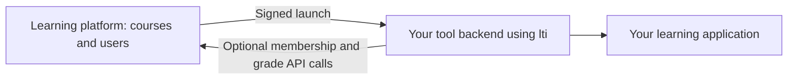

# lti

Build the backend of an **LTI 1.3 tool** in Dart. This package verifies launches
from learning platforms and supports activity selection, course memberships and
grades without depending on a particular HTTP framework.

**Development release; not formally certified.** Dart 3.13 or newer is required.

## What is LTI?

**Learning Tools Interoperability (LTI)** is a standard for connecting a learning
platform (an LMS, such as ByCS) to an external learning application (a tool).

For example, a teacher places a link to your quiz in a course. When a learner
clicks it, the platform sends your backend a signed launch message. It can tell
your tool which activity and course were opened, who the learner is and their
course roles, subject to the platform's privacy settings. Your tool can then
create an application session without asking for the learner's LMS password.

LTI is the connection protocol. You still build the quiz, its interface, storage
and application permissions. Optional LTI Advantage features let a teacher choose
an activity, let your backend read course memberships, and let it send scores
back to the gradebook.



These APIs run on the **server**, including if your frontend uses Flutter Web.
For a ready-made HTTP integration, start with the
[Shelf quickstart](https://github.com/fischerscode/lti.dart/blob/main/packages/lti_shelf/README.md).
It handles redirects, cookies and POST bodies for you.

## The main building blocks

| API | Responsibility |
| --- | --- |
| `LtiRegistration` | Trusted platform identifiers, endpoints and allowed activity URLs |
| `LtiTool` | Starts login and verifies the resulting launch |
| `LtiTransactionStore` | Keeps short-lived, one-use login state |
| `RemoteJwksVerifier` | Fetches platform public keys and checks launch signatures |
| `LtiJwtSigner` | Signs outgoing tool messages using your persistent private key |
| `LtiServiceClient` | Reads memberships and works with grades for a verified launch |

**JWKS** means a JSON set of public keys. The platform's keys verify incoming
launches; your tool's keys let the platform verify your outgoing messages.
**OIDC** (OpenID Connect) is the login protocol used by LTI. **JWT** means JSON
Web Token; LTI uses signed JWTs for its messages. You normally use the typed APIs
instead of handling JWTs yourself.

## Configure a tool

Add the published packages to your backend's `pubspec.yaml`, then run
`dart pub get`:

```yaml
dependencies:
  lti:
  http:
```

An omitted version means `any`: pub resolves versions compatible with your SDK
and other dependencies. An existing `pubspec.lock` keeps its resolved versions
when possible; use `dart pub upgrade` to update them. Alternatively,
`dart pub add lti http` selects compatible releases and writes version constraints
for you.

This complete construction example uses placeholder platform values. Replace them
with the exact configuration provided by your platform administrator:

```dart
import 'package:http/http.dart' as http;
import 'package:lti/lti.dart';

LtiTool buildTool(http.Client client) {
  final registration = LtiRegistration(
    issuer: 'https://platform.example',
    clientId: 'assigned-client-id',
    deploymentIds: {'assigned-deployment-id'},
    authenticationEndpoint: Uri.parse('https://platform.example/authorization'),
    jwksUri: Uri.parse('https://platform.example/keys'),
    redirectUri: Uri.parse('https://tool.example/lti/launch'),
    targetLinkUris: {'https://tool.example/activity'},
  );

  return LtiTool(
    registrations: MemoryLtiRegistrationStore([registration]),
    transactions: MemoryLtiTransactionStore(),
    tokenVerifier: RemoteJwksVerifier(client: client),
  );
}
```

This builds the protocol service, not an HTTP server. Pass the result to
`LtiShelf`, or implement the HTTP flow below. Reuse the caller-owned HTTP client
and close it when your server shuts down. The memory transaction store is useful
for single-isolate development; production needs a shared, atomic implementation.

The **client ID** identifies the tool registration. A **deployment ID** identifies
a deployment of that registration. The **issuer** identifies the platform.
Configure these from trusted administrator-supplied values, never from an
unverified login request. Target URLs and the callback must match exactly.

## Using another HTTP framework

If you use Shelf, its adapter already implements these steps. For a custom adapter:

1. Accept the platform's login-initiation GET or form POST. Reject duplicate
   parameters and limit the request size. Parse with `LtiLoginRequest.fromParameters`.
2. Call `tool.beginLogin(request)`. Store the returned `browserBinding` in protected
   browser storage, such as a secure, HttpOnly cookie, associated with the returned
   state. Redirect the browser to the returned `uri`.
3. On the platform's callback POST, read `state` and `id_token`. Obtain the binding
   from that same browser's protected storage, **not from the platform form**.
4. Call `tool.completeLaunch(state: ..., browserBinding: ..., idToken: ...)`.
   Dispatch the verified `LtiResourceLaunch` or `LtiDeepLinkingLaunch` to your code.
5. Authorize the application action and establish your own application session.

Also handle platform login-error callbacks with `completeLoginError`, passing
state and the browser binding. `completeResourceLaunch` is available for adapters
that only support resource launches. API Dartdocs describe errors and validation
contracts; the Shelf adapter is a useful implementation reference.

## Working with a verified launch

| Launch field | Typical use |
| --- | --- |
| `user` | Optional user identity/profile; may be null for anonymous launches |
| `context` | Optional course or other context |
| `roles` | Platform-supplied roles to evaluate in your authorization policy |
| `resourceLink` on a resource launch | Identifies the particular activity link in the course |
| `custom` | Platform-supplied application parameters |
| `ags` / `nrps` | Advertised grade/membership capabilities; null when absent |

Use the platform issuer plus user subject as an account identity. Scope access to
the appropriate deployment and context. Do not use an email address as a stable
identity or assume that a name/email will be present. Protocol verification alone
does not authorize exporting a class roster or modifying grades.

## Add LTI Advantage features

### Deep Linking: let a teacher choose an activity

A Deep Linking launch asks your tool to show an activity selector. It is different
from a resource launch, which opens an activity that has already been placed in
a course.

Keep the verified `LtiDeepLinkingLaunch` in a protected server session, show your
selection UI, and authorize the submitted selection. Call
`tool.createDeepLinkingResponse` with the selected `LtiContentItem` values and
return the signed response to the platform. An empty list cancels the selection.
The library checks the platform's accepted item types and selection limits.
With Shelf, `deepLinkingFormResponse` creates the browser's return form.

### Signing: configure one persistent tool key

Deep Linking responses and service authentication need an `LtiJwtSigner`:

```dart
final signer = LtiJwtSigner(
  keys: MemoryLtiSigningKeyProvider(
    RsaLtiSigningKey.fromPem(privatePem, keyId: 'tool-key-1'),
  ),
);
```

Here `privatePem` is an RSA private key loaded from your application's secret
storage (at least 2048 bits). Pass `signer` to `LtiTool`. Publish its public keys
through the Shelf JWKS route, or provide the public key in the format required
by your platform. Retain the key across restarts and never send the private key
to the browser or platform.

### NRPS and AGS: read memberships and work with grades

**NRPS** means Names and Role Provisioning Services: course membership access.
**AGS** means Assignment and Grade Services: gradebook columns, scores and results.
The platform must enable the relevant capabilities and permissions for your tool.

Add the administrator-provided `tokenEndpoint` to your `LtiRegistration`. Create
one reusable OAuth client using your signer and HTTP client, then a service client
for each verified launch:

```dart
final oauth = LtiOAuthClient(client: httpClient, signer: signer);

final services = LtiServiceClient(
  launch: verifiedLaunch,
  oauth: oauth,
  client: httpClient,
  // Administrator-configured service origins; never infer from launch data.
  allowedOrigins: {Uri.parse('https://platform.example')},
);

if (verifiedLaunch.nrps != null) {
  // Run only after your application authorizes access to this course roster.
  var learnerCount = 0;
  await for (final member in services.nrps.allMemberships(limit: 100)) {
    if (member.roles.contains(LtiRoles.learner)) learnerCount++;
  }
  print('Learners in this course: $learnerCount');
}
```

This excerpt assumes `httpClient`, `signer` and `verifiedLaunch` already exist.
The service client obtains scoped access tokens for you. You usually do not need
to call `oauth.accessToken` directly. Affected Moodle/ByCS token endpoints require
the explicit `allowMoodleTokenContentType` option on `LtiOAuthClient`; see the
[OAuth guide](https://github.com/fischerscode/lti.dart/blob/main/docs/oauth.md).

Use `services.ags` to list/create/update/delete **line items** (gradebook columns),
publish scores and read results. A null `LtiScore.scoreGiven` **clears** a previous
score. Persist increasing score-update timestamps per learner/column. Writes are
not automatically retried: a failed request may already have changed platform data.

## Where to go next

- Run the first-launch example in the
  [Shelf quickstart](https://github.com/fischerscode/lti.dart/blob/main/packages/lti_shelf/README.md).
- Use API Dartdocs in your IDE for parameters, exceptions and examples.
- Follow the detailed guides for
  [Deep Linking](https://github.com/fischerscode/lti.dart/blob/main/docs/deep-linking.md),
  [signing](https://github.com/fischerscode/lti.dart/blob/main/docs/signing.md),
  [OAuth](https://github.com/fischerscode/lti.dart/blob/main/docs/oauth.md) and
  [services](https://github.com/fischerscode/lti.dart/blob/main/docs/services.md).

Tool-side Core and Advantage are implemented; Dynamic Registration is a separate,
unimplemented extension. Test interoperability with your target platform before
release. Your application supplies durable storage, sessions, authorization and
the learning experience itself.
