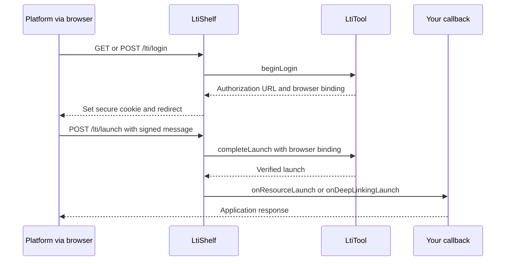

# lti_shelf

Connect a Dart Shelf server to an **LTI 1.3 learning platform** such as ByCS.
When someone opens your activity from their course, this adapter handles the
login exchange and calls your code with a verified launch.

This is a server-side package. Your activity UI can use Flutter Web, HTML or
another frontend. The underlying `lti` package handles the protocol; `lti_shelf`
provides HTTP routes and browser binding.

**Development release; not formally certified.**

## Your first launch

The easiest starting point is the included server example, `example/server.dart`.
It prints `LTI resource launch verified.` in the browser after a successful
launch. It does not yet create an application session or display learning content.

You need:

- Dart 3.13 or newer, or the repository's FVM SDK.
- Access to a platform's external-tool/LTI registration settings, possibly through an administrator.
- An HTTPS address for your tool, reachable from the learner's browser. Platform services also need access to your public-key URL when you use one.

For the first test, select a **new window/top-level launch** in the platform if
available. Set up iframe embedding after the basic launch works.

### 1. Prepare the example

From the root of a checkout of this repository:

```sh
fvm install
fvm dart pub get
fvm dart run melos bootstrap
```

The example listens over HTTP on `127.0.0.1:8080`. Put an HTTPS reverse proxy or
tunnel in front of it and forward requests to that address. In the instructions
below, `https://tool.example` means **your real HTTPS address**.

### 2. Register the tool in the platform

Choose **LTI 1.3** and enter these tool URLs. Field names differ between platforms.

| Platform setting | Value for this example |
| --- | --- |
| Tool / target / activity URL | `https://tool.example/activity` |
| Login initiation / OIDC login URL | `https://tool.example/lti/login` |
| Redirect / callback URL | `https://tool.example/lti/launch` |
| Public key / JWKS URL, if a signer is configured | `https://tool.example/lti/jwks` |

`/activity` identifies the activity being launched. In this minimal example the
verified content is returned from `/lti/launch`; there is no standalone
`GET /activity` page. Your real application can create a session and redirect to
its own activity route after verification.

Some platforms require a tool public key during registration even for this first
test. Configure the optional signing key in step 3 before completing that setup.

Save the registration and obtain the following values from the platform or its
administrator. Some platforms show the client ID only when editing the saved tool.

| Value from the platform | Environment variable | Meaning |
| --- | --- | --- |
| Issuer | `LTI_ISSUER` | Exact platform identifier |
| Client ID | `LTI_CLIENT_ID` | Assigned tool identifier |
| Deployment ID | `LTI_DEPLOYMENT_ID` | Assigned deployment identifier |
| Authorization endpoint | `LTI_AUTH_ENDPOINT` | Where the browser is sent during login |
| Platform JWKS URL | `LTI_JWKS_URI` | Platform public keys for checking incoming launches |

There are **two different public-key URLs**: the platform's JWKS URL goes into
your server configuration; your tool's `/lti/jwks` URL goes into the platform.
Never guess identifiers or copy endpoint configuration from an unverified launch.

### 3. Configure and start the server

In Bash/WSL, replace every example value with your own configuration:

```sh
export TOOL_ORIGIN='https://tool.example'
export LTI_ISSUER='https://platform.example'
export LTI_CLIENT_ID='assigned-client-id'
export LTI_DEPLOYMENT_ID='assigned-deployment-id'
export LTI_AUTH_ENDPOINT='https://platform.example/authorization'
export LTI_JWKS_URI='https://platform.example/keys'

fvm dart run packages/lti_shelf/example/server.dart
```

`TOOL_ORIGIN` is only the external HTTPS origin, with a port if needed and no
route suffix. Endpoint paths above are placeholders, not platform defaults.
The startup message should report a listener on localhost port 8080.

If a tool signing key is needed, generate a persistent development key once
(using OpenSSL), set these variables, then start the server:

```sh
openssl genpkey -algorithm RSA -pkeyopt rsa_keygen_bits:2048 -out tool-private.pem
export LTI_PRIVATE_KEY_FILE="$PWD/tool-private.pem"
export LTI_KEY_ID='tool-key-1'
```

Keep the private file outside version control and retain the same key across
restarts. Only share the public key or public JWKS URL with the platform. To
obtain a PEM public key for platforms using direct RSA configuration:

```sh
openssl pkey -in tool-private.pem -pubout -out tool-public.pem
```

Without these optional variables, the example verifies incoming launches but
does not expose `/lti/jwks` or sign outgoing messages.

### 4. Open the activity from the course

Add the registered tool as a course activity and open it through the platform.
A successful launch displays:

```text
LTI resource launch verified.
```

Opening `/lti/launch` directly in a browser is not a launch: it requires the
platform's POST after the login exchange. Opening `/lti/login` without platform
parameters also cannot start a valid test.

## Where does my application code go?

The example constructs an `LtiTool` from the trusted registration, a transaction
store and a signature verifier. It then connects that tool to Shelf:

```dart
final adapter = LtiShelf(
  tool: tool, // Your configured LtiTool; see example/server.dart.
  publicOrigin: Uri.parse('https://tool.example'),
  onResourceLaunch: (request, launch) {
    // Use launch.user, launch.context, launch.roles and launch.resourceLink.
    // Authorize the user, create your session and show/redirect to the activity.
    return Response.ok('LTI resource launch verified.');
  },
);
final handler = adapter.handler;
```

This excerpt uses `package:lti_shelf/lti_shelf.dart` and
`package:shelf/shelf.dart`; the complete example includes all imports and setup.
Mount the handler at the server root. Compose your application's additional
routes with it; unmatched paths return 404. The callback's request body has
already been read by the adapter.

A verified launch proves the protocol checks passed. It does not automatically
grant permission to edit content or grades. Your code makes those decisions.
Users may be anonymous; names and email addresses may be absent.

## Use it in your own project

Until you are using a published release, point to both packages in your local
checkout (adjust the relative paths):

```yaml
dependencies:
  lti:
    path: ../lti.dart/packages/lti
  lti_shelf:
    path: ../lti.dart/packages/lti_shelf
  http: ^1.6.0
  shelf: ^1.4.2
```

Run `dart pub get`, then copy/adapt `example/server.dart` into `bin/server.dart`.
Run it with `dart run bin/server.dart` using the same environment variables.
Both packages require Dart 3.13 or newer. When consuming a published release,
replace the path dependencies with the published versions.

## What happens during a launch?



## Add selection, memberships and grades

- **Deep Linking:** configure `onDeepLinkingLaunch` to show a teacher your activity
  selector. Retain the verified launch in a protected server session. After an
  authorized selection, call `tool.createDeepLinkingResponse` and return it with
  `deepLinkingFormResponse`. An empty selection cancels. A tool signer is required.
- **Memberships and grades:** use `LtiServiceClient` from `lti` inside your backend.
  These are outgoing platform API calls, not additional Shelf routes. See the
  `lti` package README for client construction.

## Embedding and deployment

For iframe launches, set `partitionedCookies: true` to opt into partitioned
cookies in supporting browsers. The adapter requires its secure browser-binding
cookie; if the browser blocks it, use a top-level launch. Disabling binding is
not a fallback.

Dart's HTTP server supplies `X-Frame-Options: SAMEORIGIN` by default. To allow an
LMS iframe, configure the server/proxy to replace it with a Content Security
Policy whose `frame-ancestors` allows your trusted platform origins. The
ByCS test server (`example/bycs_server.dart`) demonstrates this setup.

Before production, replace `MemoryLtiTransactionStore` with durable, shared,
atomic storage, add your application session/authorization, and configure request
timeouts and login rate limiting. The application owns and closes the HTTP client.

Verified launch responses always use `Cache-Control: no-store`. An application
`Referrer-Policy` is preserved; otherwise the default is `no-referrer`. For native
POST forms that validate `Origin`, use `strict-origin` so the browser can preserve
the origin rather than sending `Origin: null`.

## Troubleshooting the first launch

| Symptom | What to check |
| --- | --- |
| Browser times out | HTTPS, DNS, proxy/tunnel forwarding and firewall; confirm the request reaches your server |
| `unknownRegistration` | Exact issuer and client ID; save/reopen the platform registration to find assigned values |
| Rejected target or callback | Tool URL is in `targetLinkUris`; callback exactly matches the registered `/lti/launch` URL |
| `invalidState` / browser binding missing | Start a fresh launch from the platform; check cookie policy and try a top-level launch |
| Token issued in the future / expired | Synchronize the server clock before changing validation tolerances |
| `/lti/jwks` returns 404 | Configure `LTI_PRIVATE_KEY_FILE` and `LTI_KEY_ID`, then restart the example |
| Membership or grade service unavailable | Enable the feature and permissions in the platform, configure signing/token endpoint, and launch again |

Use `onProtocolError` for server-side diagnostics. Do not log tokens, raw launch
bodies or private keys. The ByCS runner adds diagnostic and explicit service-test
screens; it is separate from this minimal example and is not a production app.
